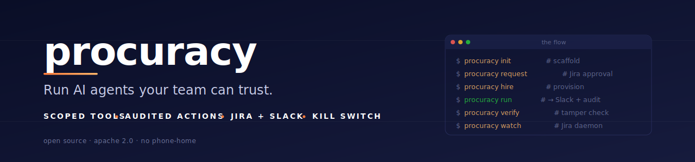
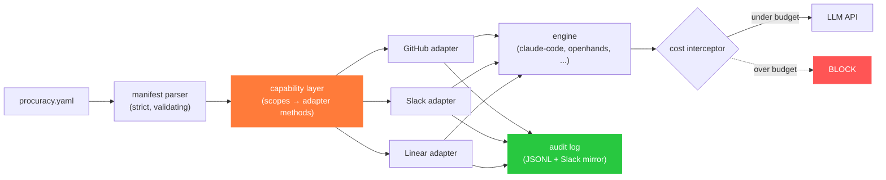
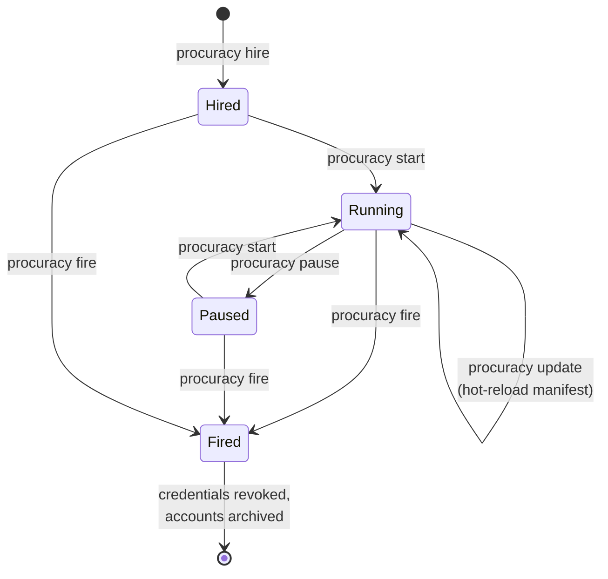

<div align="center">



<br/>

[](https://github.com/procuracy/procuracy/actions/workflows/ci.yml)
[](go.mod)
[](https://goreportcard.com/report/github.com/procuracy/procuracy)
[](LICENSE)
[](#status)
[](CONTRIBUTING.md)

**[Try it in 60 seconds](#try-it-in-60-seconds)** · **[Why](#why-procuracy)** · **[How it works](#how-it-works)** · **[Templates](#templates)** · **[Security](#security-model)** · **[Comparisons](#comparisons)** · **[Roadmap](#roadmap)**

</div>

---

> **One declarative file describes an AI contractor: who they are, what they can touch, when they work, what they cost, and how to fire them.**
> No new dashboard. No SaaS dependency. No telemetry. Your infra, your data, your kill switch.

```yaml
# procuracy.yaml — the contractor in one file
name: aria
identity:
  github_username: aria-acme
scopes:
  github:
    - read:org/*
    - write:org/docs/**       # path-scoped writes only
    - merge:none              # explicit denial — adapter physically cannot merge
runtime:
  engine: claude-code
  cost_limit_daily_usd: 50    # over-budget LLM calls are BLOCKED, not logged
```

```bash
$ procuracy hire ./aria/        # provisions all accounts (v0.1)
$ procuracy start ./aria/       # runs the agent loop (v0.1)
$ procuracy logs aria           # tails the audit log (v0.1)
$ procuracy fire aria           # revokes everything in <30s (v0.1)
```

**Five minutes from `git clone` to a working AI contractor on your repo.** That is the goal of v0.1.

---

## ⚠️ Status

procuracy is **alpha**. The manifest spec is stable. The CLI surface is locked. **Most subcommands are not yet implemented.**

| Capability | State |
|---|---|
| Manifest spec ([`docs/manifest-spec.md`](docs/manifest-spec.md)) | ✅ Stable, v0.1 |
| Manifest parser + validator (`procuracy validate`) | ✅ **Working today** |
| CLI surface (`hire start pause update logs report fire auth init`) | 🟡 Stub commands defined, exit 64 with `not implemented` |
| Capability enforcement layer | 🔨 Next |
| Audit log (hash-chained JSONL) | 🔨 Next |
| GitHub adapter | 🔨 Next |
| First end-to-end template (`stale-pr-nudger`) | 🔨 Next |
| Slack / Linear / Jira / Notion adapters | 📋 After v0.1 |

If you're evaluating procuracy for production use, **wait for v0.1**. If you're evaluating it for *contributing* — adapters and templates are the highest-leverage work and we'd love your PRs. See [`CONTRIBUTING.md`](CONTRIBUTING.md).

> **⚠️ Considering procuracy for an enterprise (>30 people, IdP-managed, multi-actor provisioning)?** The single-operator OAuth flow described in this README **does not fit your environment**, and we are not pretending otherwise. Please read [`docs/enterprise-provisioning.md`](docs/enterprise-provisioning.md) before assuming `procuracy hire` will work for you. It captures the gap between procuracy v0.1 and real enterprise reality, and lays out the v0.2+ trajectory for IdP-first identity, group-based scoping, request/approve/provision separation of duties, Jira as a tier-1 adapter, AWS multi-account, and SCIM-aware termination.

---

## Try it in 60 seconds

What you can actually do today: install the binary, write a manifest, validate it. The full lifecycle commands land in v0.1.

### Prerequisites

- **Go 1.25+** (only build dependency — single static binary, zero runtime deps)
- A terminal

### 1. Install

```bash
go install github.com/procuracy/procuracy/cmd/procuracy@latest
procuracy version
# → 0.1.0-dev
```

> The `curl | sh` installer ships with v0.1. Until then, `go install` is the supported path.

### 2. Write a manifest

```bash
cat > aria.yaml <<'EOF'
name: aria
display_name: "Aria — Docs Maintainer"
identity:
  github_username: aria-acme
scopes:
  github:
    - read:org/*
    - write:org/docs/**
    - merge:none
triggers:
  - on: github.pull_request.merged
    where: files matches 'src/api/**'
    do: review_doc_drift
runtime:
  engine: claude-code
  workspace: /tmp/procuracy/aria
  cost_limit_daily_usd: 50
  cost_limit_per_task_usd: 5
handlers:
  review_doc_drift:
    type: claude_code
    prompt: prompts/review.md
EOF
```

### 3. Validate it

```bash
procuracy validate aria.yaml
# → ok: aria (1 trigger(s), 1 handler(s))
```

The validator runs the full v0.1 spec pipeline: strict YAML decoding, name regex, cost-limit sanity checks, schedule/cron coupling, scope→identity cross-references, undefined-handler detection. Mistype a field name, swap an absolute path for a relative one, or set a per-task budget greater than the daily one — every error is caught at validate time, not at 3am in production.

That's everything that runs today. The rest of this README is what v0.1 will deliver.

---

## Why procuracy

Every team that wants AI to do real work in their org rebuilds the same five things from scratch:

1. **Identity** — who is this thing? What email? What GitHub account? What Slack handle?
2. **Permissions** — what can it touch? How do we *prove* it can't touch the rest?
3. **Triggers** — when does it run? Which webhooks? Which polling loops?
4. **Audit** — what did it do? When? At what cost? Who approved it?
5. **Termination** — how do we fire it cleanly when we don't trust it anymore?

Every existing tool gives you *one or two* of these and asks you to figure out the rest:

| Tool | Identity | Scope | Audit | Lifecycle | Open source |
|---|:-:|:-:|:-:|:-:|:-:|
| **Devin** (Cognition) | ✓ | ✓ | partial | partial | ✗ |
| **GitHub Copilot Workspace** | ✗ | ✓ | partial | ✗ | ✗ |
| **Sweep AI** | ✓ | partial | ✗ | ✗ | partial |
| **OpenHands** | ✗ | ✗ | ✗ | ✗ | ✓ |
| **Claude Code / Aider / Cursor** | ✗ | ✗ | ✗ | ✗ | partial |
| **procuracy** | **✓** | **✓** | **✓** | **✓** | **✓** |

**procuracy is the missing layer between "agent runtime" and "real org adoption."** It does not replace Claude Code, OpenHands, or any other agent — it *wraps* them with the org integration that makes them deployable in environments that need accountability, audit, and reversibility.

If [Stripe](https://stripe.com) made it 5 minutes to accept payments and [Vercel](https://vercel.com) made it 5 minutes to deploy a website, **procuracy makes it 5 minutes to hire an AI contractor.**

---

## The core idea: one file describes a contractor

Everything an AI contractor *is* fits in a single declarative manifest. Like a `Dockerfile` defines a runnable image and a `package.json` defines a project, **`procuracy.yaml` defines an employee.**

```yaml
name: aria
display_name: "Aria — Docs Maintainer"
description: |
  Keeps API docs in sync with code. Reviews stale PR descriptions.
  Drafts changelog entries on release.

# Who they are
identity:
  email: aria@acme.com
  github_username: aria-acme
  slack_handle: aria
  linear_user: aria

# What they can do (capability-based, enforced at the adapter layer)
scopes:
  github:
    - read:org/*
    - write:org/docs/**           # path-scoped writes
    - pr:create:org/docs
    - merge:none                  # explicit denial
  slack:
    - post:#engineering
    - post:#aria-log
    - dm:none
  linear:
    - read:project/eng
    - comment:project/eng
    - transition:project/eng/{Todo,InProgress,InReview,Done}

# When they work
triggers:
  - on: linear.issue.assigned
    where: assignee == 'aria'
    do: handle_ticket
  - on: github.pull_request.merged
    where: files matches 'src/api/**'
    do: review_doc_drift
  - on: schedule
    cron: "0 9 * * 1-5"
    do: daily_standup

# How they think
runtime:
  engine: claude-code              # also: openhands, openai-assistants, custom
  model: claude-opus-4-6
  workspace: /var/procuracy/aria
  cost_limit_daily_usd: 50
  cost_limit_per_task_usd: 5

# What they do (handlers point to prompts or scripts)
handlers:
  handle_ticket:
    type: claude_code
    prompt: prompts/handle_ticket.md
  review_doc_drift:
    type: claude_code
    prompt: prompts/review_doc_drift.md
  daily_standup:
    type: claude_code
    prompt: prompts/daily_standup.md

# Where humans watch the work
observability:
  audit_channel: "#aria-log"
  metrics: prometheus://localhost:9090

# How to fire them
termination:
  on_kill_signal:
    - revoke: github_token
    - revoke: slack_token
    - revoke: linear_token
    - archive_accounts: true
    - notify: "#engineering"
```

**Read the file once and you know exactly who this contractor is, what it can touch, when it works, what it costs, and how to fire it.** Versioned in git, reviewed in PRs, auditable forever. Full schema reference: [`docs/manifest-spec.md`](docs/manifest-spec.md).

---

## How it works

### Architecture



The capability layer is the key trick: when an adapter is constructed for a specific contractor, it is *built from* that contractor's parsed scope set. A GitHub adapter for a contractor with `merge:none` literally does not have a `MergePR` method. The LLM cannot call a tool that does not exist — no clever prompt can change that.

### Lifecycle



A contractor has a clean start, middle, and end. procuracy owns the lifecycle so individual teams don't have to:

```bash
procuracy hire ./aria       # provisions all accounts
procuracy start ./aria      # starts the runtime loop
procuracy logs aria         # tails the audit log
procuracy pause aria        # suspends without revoking
procuracy update ./aria     # hot-reload the manifest
procuracy report aria       # weekly performance summary
procuracy fire aria         # revoke all credentials, archive accounts
```

Six commands. No web UI. No SaaS dashboard. **The Slack channel + the audit log is the dashboard.**

---

## The four primitives

### 1. Identity
Real, scoped accounts on the tools your team already uses. **Not a shared bot.** Not a wrapper around a human's credentials. A separate, auditable, revocable principal — exactly like a human contractor.

`procuracy hire` provisions:
- Email (Google Workspace / Microsoft 365 / SendGrid)
- GitHub user (via OAuth App, scoped permissions)
- Slack bot user (via OAuth App, channel-scoped)
- Linear / Jira / GitHub Issues user (via OAuth)

You approve each integration in your browser. procuracy stores the tokens locally, never phones home.

### 2. Scope
The `scopes:` section of the manifest is a **capability declaration**. The runtime enforces it at the adapter layer — meaning the contractor's GitHub adapter physically does not have the API capability to merge PRs if `merge:none` is set. Not "instructed not to." *Cannot.*

**Capability-based security, not instruction-based security.** No clever prompt injection can grant a capability the adapter does not have.

### 3. Audit
Every action the contractor takes is logged in two places:

- **Slack** — `#aria-log` channel gets a real-time post for every tool call, every API hit, every file edit, every dollar spent
- **Local JSONL** — append-only log on disk, hash-chained, exportable for compliance

Want to know what aria did last Tuesday? Read the log. Want to give it to your security team? Export the JSONL. **The audit log is the trust layer.** Without it, no enterprise will adopt AI contractors. With it, your security review takes a day instead of a month.

### 4. Lifecycle
`procuracy fire` revokes every credential and archives every account in under 30 seconds. **Adoption is fearless because un-adoption is trivial.**

---

## Templates

The fastest way to adopt procuracy is to **fork a template**, not write a manifest from scratch. Templates are community-contributed, single-purpose, and one-command-clonable.

Initial templates planned for v0.1:

| Template | What it does | Risk level |
|---|---|---|
| **stale-pr-nudger** | Comments on stale PRs, summarizes context for resumed reviews | Very low |
| **dependabot-merger** | Reviews and merges trivial dependabot PRs | Low |
| **docs-maintainer** | Keeps docs in sync with code, drafts updates as PRs | Low |
| **test-coverage-backfill** | Writes tests for files below a coverage threshold | Low |
| **release-notes-writer** | Drafts changelog entries from merged PRs | Low |
| **issue-triager** | Labels and triages incoming issues, asks clarifying questions | Low |

Want to contribute a template? See [`CONTRIBUTING.md`](CONTRIBUTING.md). Templates are just directories with a `procuracy.yaml` and prompts — **no Go code required**.

---

## Security model

Trust is the only thing that matters in this category. procuracy is built around five non-negotiable security properties:

1. **Capability-based, not instruction-based.** Permissions are enforced at the integration adapter layer, before any LLM is invoked. The agent's prompt cannot grant itself a capability that the adapter physically does not have.

2. **Failing closed on cost.** Every LLM API call is intercepted; if the daily or per-task budget would be exceeded, the call is *blocked*, not just logged. Cost runaways are impossible by construction.

3. **Tamper-evident audit.** Logs go to Slack (which the contractor cannot edit history of) AND to a local append-only JSONL with hash-chained entries. Forging history is detectable.

4. **One-command revocation.** `procuracy fire` revokes every credential and archives every account in under 30 seconds. Adoption is fearless because un-adoption is trivial.

5. **No phone-home.** procuracy never sends data to a hosted service. All credentials, all logs, all manifests live on your infra. The framework is purely local.

Found a vulnerability? Please report it via [GitHub Security Advisories](https://github.com/procuracy/procuracy/security/advisories/new), not a public issue.

---

## Comparisons

### vs. Devin (Cognition)
Devin pioneered the "AI software engineer with its own identity" framing, and remains the closest existing thing to a procuracy-shaped product. Differences:

- **Open source** vs. closed
- **Multi-engine** (Claude Code, OpenHands, custom) vs. single proprietary engine
- **Self-hosted** vs. SaaS-only
- **Manifest-driven** vs. UI-driven
- **No per-seat pricing** vs. ~$500/seat/month
- **Forkable templates** vs. opaque

### vs. GitHub Copilot Workspace
Copilot Workspace is GitHub-native: it lives in the GitHub UI, runs on GitHub infra, and has no identity outside GitHub. procuracy is the opposite — it gives the contractor a presence in *every* tool your team uses, lives on your infra, and is portable across providers.

### vs. OpenHands / OpenDevin
OpenHands is the closest OSS *runtime* (the "brain"). procuracy is not a runtime — it's the *body*: identity, scopes, lifecycle, audit. **They compose.** A future version of procuracy will list `engine: openhands` as a first-class option alongside `engine: claude-code`.

### vs. Claude Code / Aider / Cursor (raw)
These are session-bound pair programmers. You spawn one, talk to it, dismiss it. procuracy makes them long-running participants in an org's workflow. Same engine, totally different mental model.

### vs. agent frameworks (LangGraph, CrewAI, AutoGen)
Frameworks are libraries for building agents from scratch. procuracy is the *org-integration layer* that any framework-built agent can plug into. **You don't choose between them — you use them together.**

---

## Roadmap

| Phase | What | Status |
|---|---|---|
| **0. Foundation** | README, manifest spec, parser+validator, CLI skeleton, `validate` command, CI | ✅ Done |
| **1. Capability layer** | `internal/capability/` — adapters constructed from parsed scopes | 🔨 Next |
| **2. Audit log** | `docs/audit-log.md` + `internal/audit/` — hash-chained JSONL writer | 🔨 Next |
| **3. GitHub adapter** | First real adapter, scoped via the capability layer | 🔨 Next |
| **4. First vertical slice** | `examples/stale-pr-nudger/` end-to-end: manifest → OAuth → scope → Claude Code → audit | 🔨 Next |
| **5. v0.1 release** | Tag, signed binaries, install script, demo instance | 📋 Planned |
| **6. Slack adapter** | Audit-mirror use case (lowest stakes) | 📋 Planned |
| **7. Linear adapter** | Issue-triggered contractors | 📋 Planned |
| **8. OpenHands engine** | Second engine adapter, proves the engine interface | 📋 Planned |

**v0.1 cut decision:** ship one vertical slice — `stale-pr-nudger` on GitHub only, Claude Code engine only, JSONL audit only — before adding any second adapter. Nothing ships until that one path works end-to-end.

---

## Contributing

We need contributors most for:

- **Adapters** for new integrations (Jira, Notion, GitLab, Bitbucket, Discord, Asana, Trello, etc.)
- **Templates** for new contractor roles (the marketplace is the adoption flywheel)
- **Engine adapters** for non-Claude runtimes (OpenHands, GPT, local models)
- **Security review** of the capability enforcement layer
- **Documentation** in any language

Read [`CONTRIBUTING.md`](CONTRIBUTING.md). Open an issue before starting non-trivial work so we can avoid duplication.

---

## License

Apache License 2.0 — see [`LICENSE`](LICENSE). Free for any use, including commercial. **No telemetry, no phone-home, no hidden strings.**

---

## Acknowledgments

Built on the shoulders of:

- [Anthropic Claude](https://claude.com) and [Claude Code](https://claude.com/product/claude-code) — the engine that makes the contractor model possible
- [Cognition Labs](https://cognition.ai) for pioneering the "AI engineer with identity" framing
- [OpenHands](https://github.com/All-Hands-AI/OpenHands) and the OSS agent community for proving self-hosted agents work
- The capability-based security tradition, from KeyKOS to Capsicum to the modern web's Permissions API

---

<div align="center">

**[Try it in 60 seconds](#try-it-in-60-seconds)** · **[Read the manifest spec](docs/manifest-spec.md)** · **[Contribute](CONTRIBUTING.md)** · **[Star the repo →](https://github.com/procuracy/procuracy)**

</div>
