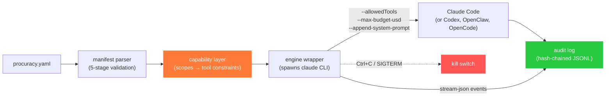

<div align="center">


<br/>

[](https://github.com/procuracy/procuracy/actions/workflows/ci.yml)
[](go.mod)
[](https://goreportcard.com/report/github.com/procuracy/procuracy)
[](LICENSE)
[](#status)
[](CONTRIBUTING.md)

**[Try it in 60 seconds](#try-it-in-60-seconds)** · **[Why](#who-is-procuracy-for)** · **[How it works](#how-it-works)** · **[Templates](#templates)** · **[Security](#security-model)** · **[Comparisons](#comparisons)** · **[Roadmap](#roadmap)**

</div>

---

> **Your team deploys AI agents across repos. procuracy makes sure they do only what they're allowed to, and you can prove it.**
>
> One manifest per agent. Scoped capabilities. Hash-chained audit log. Slack + Jira notifications. Kill switch. No SaaS, no phone-home.

```yaml
# procuracy.yaml — what the agent can do, versioned in git, reviewed in PRs
name: aria
scopes:
  github:
    - read:org/*
    - write:org/docs/**
    - merge:none              # the agent CLI will not have a merge tool
runtime:
  engine: claude-code
  cost_limit_per_task_usd: 5  # over-budget calls are BLOCKED, not logged
notifications:
  slack_webhook: ${SLACK_WEBHOOK_URL}  # your team sees it in Slack
```

```bash
# Run an agent with trust guardrails — results go to Slack automatically
$ procuracy run ./aria/ --jira-ticket PROJ-456
procuracy: running aria (engine=claude-code, model=claude-sonnet-4-6, budget=$5.00)
procuracy: completed (cost=$0.34, turns=8, duration=45000ms)
procuracy: audit log at ./aria/audit.jsonl (14 entries)

# Verify the audit trail hasn't been tampered with
$ procuracy verify ./aria/audit.jsonl
ok: 14 entries verified
```

**procuracy wraps agent CLIs you already use (Claude Code, Codex, OpenClaw, OpenCode) with the governance layer that makes them deployable in environments where accountability matters. Results post to Slack. Progress comments on Jira tickets. Audit logs are hash-chained and verifiable.**

---

## Who is procuracy for

**Not for solo developers.** If you're one person running `claude` on your laptop, just use `claude` directly. You don't need governance infrastructure.

**For teams deploying AI agents across repos where you need to answer:**

- "What can agent X touch?" → Read the manifest. It's 20 lines of YAML, versioned in git.
- "Prove agent X can't merge to main" → `merge:none` in the manifest. The agent CLI is spawned without a merge tool. Not "instructed not to" — *cannot*.
- "What did agent X do on the prod repo last Tuesday?" → `procuracy verify ./aria/audit.jsonl`. One hash-chained file per agent, tamper-evident, exportable for compliance.
- "An agent is misbehaving, revoke everything" → `procuracy fire aria`. One command.
- "We need consistent policies across 5 agents on 12 repos" → one [`groups.yaml`](examples/groups.yaml) with shared scope profiles, referenced by all manifests. One PR to change policy.
- "Where do I see what agents are doing?" → Slack. Every start/complete/fail posts to your team's channel. Jira ticket comments too.

If your security team asks "how do we know the AI agents are doing what we said?" and you don't have an answer, procuracy is the answer. **[Roll out procuracy in your org in 30 minutes →](docs/team-setup.md)**

---

## Status

procuracy is **v0.1 alpha**. The full trust pipeline works end-to-end: manifest → capability resolution → agent spawn with constrained tools → hash-chained audit log → Slack/Jira notifications → verification.

| Capability | State |
|---|---|
| `procuracy run <dir>` — run an agent with manifest-derived guardrails | ✅ Working |
| `procuracy run --jira-ticket KEY` — associate a run with a Jira ticket | ✅ Working |
| Slack notifications — agent start/complete/fail/cost-blocked posted to webhook | ✅ Working |
| Jira comments — summary posted on the ticket after each run | ✅ Working |
| `procuracy validate` — 5-stage manifest validation (schema, scopes, capability verbs) | ✅ Working |
| `procuracy verify` — hash-chain integrity verification on audit logs | ✅ Working |
| `procuracy init` — interactive manifest scaffolding | ✅ Working |
| `procuracy demo` — zero-config trial with tamper-detection walkthrough | ✅ Working |
| Capability enforcement — scope parser, glob matcher, deny-overrides-grant | ✅ Working |
| Audit log ([`docs/audit-log.md`](docs/audit-log.md)) — hash-chained JSONL, tamper-evident, concurrent-safe | ✅ Working |
| 5 templates — [stale-pr-nudger](examples/stale-pr-nudger/), [docs-maintainer](examples/docs-maintainer/), [issue-triager](examples/issue-triager/), [dependabot-merger](examples/dependabot-merger/), [release-notes-writer](examples/release-notes-writer/) | ✅ Shipped |
| [`groups.yaml`](examples/groups.yaml) — reusable scope profiles across multiple agents ([docs](docs/team-setup.md#step-6-add-a-groupsyaml-for-consistent-policy-10-minutes)) | ✅ Working |
| [Team setup guide](docs/team-setup.md) — "Roll out procuracy in your org in 30 minutes" | ✅ Shipped |
| `procuracy watch` — Jira polling daemon (assign a ticket → agent picks it up, transitions status, posts results) | ✅ Working |
| Enterprise trajectory ([`docs/enterprise-provisioning.md`](docs/enterprise-provisioning.md)) | 📋 Designed |

> **Enterprise (>30 people, IdP-managed, multi-actor provisioning)?** Read [`docs/enterprise-provisioning.md`](docs/enterprise-provisioning.md) — it captures the gap between v0.1 and real enterprise reality, and the v0.2+ trajectory.

---

## Try it in 60 seconds

### Prerequisites

- **Go 1.25+** — single static binary, zero runtime deps
- **Claude Code CLI** (`claude` on PATH) — required for `procuracy run`

### 1. Install

```bash
go install github.com/procuracy/procuracy/cmd/procuracy@latest
```

### 2. Try the demo (30 seconds)

```bash
procuracy demo
```

Generates a sample manifest + a 6-entry hash-chained audit log (including a cost-blocked entry), then walks you through validating, verifying, and corrupting a byte to see the chain break. No accounts, no config.

### 3. Scaffold your own agent (60 seconds)

```bash
procuracy init
```

7 questions → valid `procuracy.yaml` + starter prompt file. `merge:none` added automatically. Passes `procuracy validate` out of the box.

### 4. Run it

```bash
# Set your Slack webhook (optional — notifications work without it too)
export SLACK_WEBHOOK_URL="https://hooks.slack.com/services/T.../B.../xxx"

procuracy run ./aria/ --jira-ticket PROJ-456
```

Loads the manifest, resolves capabilities, spawns Claude Code with a constrained tool set and cost limit, streams every action into a hash-chained audit log. Posts start/complete/fail to Slack. Comments on the Jira ticket with results. Ctrl+C kills the agent immediately (SIGTERM).

### 5. Verify the audit trail

```bash
procuracy verify ./aria/audit.jsonl
```

Single-pass hash-chain verification. One tampered byte anywhere → the chain breaks. This is what makes the audit log a trust layer, not just a log file.

---

## How it works

### Architecture



**procuracy does not replace Claude Code.** It *wraps* it. Claude Code already knows how to talk to GitHub, edit files, run commands — procuracy's job is to constrain *which* tools the agent gets, audit *what* it does, and kill it if needed.

The trust model is hybrid (and honest about its limits):

| Layer | Enforcement | Strength |
|---|---|---|
| **Tool-level** — which tools exist in the agent's toolbox | `--allowedTools` / `--disallowedTools` on the Claude Code CLI | Capability-based (structural) |
| **Verb-level** — what the agent does within those tools | `--append-system-prompt` with deny rules from the manifest | Instruction-based (defeatable in theory) |
| **Cost** — how much the agent can spend | `--max-budget-usd` from the manifest | Enforced by Claude Code |
| **Audit** — verifiable record of everything | Hash-chained JSONL with `procuracy verify` | Tamper-evident (structural) |
| **Kill switch** — immediate termination | SIGTERM to the child process | Instant (structural) |

The tool-level and audit layers are structural — they can't be defeated by prompt injection. The verb-level layer is instruction-based and weaker; the audit log is the second line of defense that catches violations.

### The manifest

Everything an AI contractor *is* fits in a single declarative file. Like a `Dockerfile` defines a runnable image, **`procuracy.yaml` defines an agent's trust boundary.**

```yaml
name: aria
display_name: "Aria — Docs Maintainer"

identity:
  github_username: aria-acme

scopes:
  github:
    - read:org/*
    - write:org/docs/**
    - pr:org/docs
    - merge:none                  # explicit denial — always wins over grants

triggers:
  - on: github.pull_request.merged
    where: files matches 'src/api/**'
    do: review_doc_drift

runtime:
  engine: claude-code
  model: claude-sonnet-4-6
  workspace: /tmp/procuracy/aria
  cost_limit_daily_usd: 50
  cost_limit_per_task_usd: 5

handlers:
  review_doc_drift:
    type: claude_code
    prompt: prompts/review.md

notifications:
  slack_webhook: ${SLACK_WEBHOOK_URL}
  jira_base_url: ${JIRA_BASE_URL}
  jira_email: ${JIRA_EMAIL}
  jira_token: ${JIRA_API_TOKEN}
```

Read the file once and you know exactly what this agent can touch, what it costs, and how to stop it. Versioned in git, reviewed in PRs, auditable forever. Full schema: [`docs/manifest-spec.md`](docs/manifest-spec.md).

---

## Templates

The fastest way to adopt procuracy is to **fork a template**, not write a manifest from scratch. Templates are directories with a `procuracy.yaml` and prompts — no Go code required.

| Template | What it does | Risk level | Status |
|---|---|---|---|
| **[stale-pr-nudger](examples/stale-pr-nudger/)** | Comments on stale PRs, summarizes context for resumed reviews | Very low | ✅ Shipped |
| **[docs-maintainer](examples/docs-maintainer/)** | Keeps docs in sync with code, drafts update PRs | Low | ✅ Shipped |
| **[issue-triager](examples/issue-triager/)** | Labels, categorizes, asks clarifying questions on new issues | Low | ✅ Shipped |
| **[dependabot-merger](examples/dependabot-merger/)** | Reviews and auto-merges trivial dep bumps (patch/minor only, CI must pass) | Low | ✅ Shipped |
| **[release-notes-writer](examples/release-notes-writer/)** | Drafts changelog from merged PRs, grouped by category | Low | ✅ Shipped |

All templates ship with Slack notification config (`${SLACK_WEBHOOK_URL}`). The issue-triager also includes Jira config for cross-posting results to tickets.

Want to contribute a template? See [`CONTRIBUTING.md`](CONTRIBUTING.md). Templates are just directories with a `procuracy.yaml` and prompts — **no Go code required**.

---

## Security model

procuracy is built around five security properties:

1. **Capability-based tool scoping.** The agent CLI is spawned with `--allowedTools` / `--disallowedTools` derived from the manifest. Tools not in the list don't exist in the agent's toolbox. This is structural — no prompt injection can add a tool that wasn't granted.

2. **Failing closed on cost.** `--max-budget-usd` is set from the manifest's cost limit. Over-budget calls are blocked by the agent CLI itself.

3. **Tamper-evident audit.** Every action is recorded in a hash-chained JSONL file (`sha256(prev_hash || entry)`). Modifying a single byte in any past entry breaks the chain. `procuracy verify` checks the entire chain in one pass.

4. **Kill switch.** Ctrl+C / SIGTERM kills the agent process immediately. No poll-based cancellation, no graceful shutdown negotiation. The process dies, the audit log records it.

5. **No phone-home.** procuracy never sends data to a hosted service. All manifests, all logs, all credentials live on your infra.

Found a vulnerability? Report it via [GitHub Security Advisories](https://github.com/procuracy/procuracy/security/advisories/new), not a public issue.

---

## Comparisons

| Tool | Scoped capabilities | Tamper-evident audit | Cost controls | Kill switch | Manifest-driven | Open source |
|---|:-:|:-:|:-:|:-:|:-:|:-:|
| **Multica** | ✗ (bypassPermissions) | ✗ | ✗ (tracking only) | ✗ (poll-based) | ✗ (DB-driven) | ✓ |
| **Devin** | partial | partial | partial | partial | ✗ | ✗ |
| **OpenHands** | ✗ | ✗ | ✗ | ✗ | ✗ | ✓ |
| **Raw Claude Code / Codex** | manual | ✗ | manual | Ctrl+C | ✗ | partial |
| **procuracy** | **✓** | **✓** | **✓** | **✓** | **✓** | **✓** |

### vs. Multica
Multica is a great "Linear for human+agent teams" — board view, real-time streaming, skills marketplace, multi-runtime orchestration. But agents run with `--permission-mode bypassPermissions` hardcoded, there's no audit trail of individual agent actions, and no capability scoping. **Multica is where you manage agents. procuracy is how you trust them.**

### vs. raw Claude Code / Codex
If you're one person, just use the CLI directly. procuracy adds value when you have *multiple agents* across *multiple repos* and need *consistent policies*, *verifiable audit trails*, and *enforceable cost limits* — things a solo developer manages in their head but a team needs in a file.

### vs. Devin / OpenHands
Runtimes. procuracy is not a runtime — it wraps runtimes. They compose: Claude Code (or OpenHands) provides the agent brain, procuracy provides the governance body.

---

## Roadmap

| Phase | What | Status |
|---|---|---|
| Foundation | Manifest spec, parser, validator, CLI skeleton, CI | ✅ Done |
| Capability layer | Scope parser, glob matcher, deny-overrides-grant, stage 5 validation | ✅ Done |
| Audit log | Hash-chained JSONL writer + verifier, `procuracy verify` | ✅ Done |
| Engine wrapper | Claude Code CLI orchestration, `procuracy run` | ✅ Done |
| Low friction | `procuracy demo`, `procuracy init` | ✅ Done |
| v0.1 release | Tag, goreleaser, 6 platform binaries | ✅ Done |
| Slack + Jira notifications | Webhook notifications on start/complete/fail, Jira ticket comments | ✅ Done |
| 5 templates | stale-pr-nudger, docs-maintainer, issue-triager, dependabot-merger, release-notes-writer | ✅ Done |
| `groups.yaml` | Reusable scope profiles — define once, reference from N manifests | ✅ Done |
| Team setup guide | [Roll out procuracy in your org in 30 minutes](docs/team-setup.md) | ✅ Done |
| `procuracy watch` | Jira polling daemon — assign a ticket, agent picks it up, transitions status | ✅ Done |
| Team setup guide | [Roll out procuracy in your org in 30 minutes](docs/team-setup.md) | ✅ Done |
| **`procuracy request`** | **Jira-based approval flow for new agents** | **Next** |
| Engine wrappers | Codex, OpenClaw, OpenCode | v0.2 |
| Enterprise | IdP integration, SCIM, three-actor approval flow | v0.2 ([design](docs/enterprise-provisioning.md)) |

---

## Contributing

We need contributors most for:

- **Templates** for new contractor roles (the adoption flywheel)
- **Engine wrappers** for Codex, OpenClaw, OpenCode
- **Security review** of the capability enforcement and audit chain
- **Documentation** in any language

Read [`CONTRIBUTING.md`](CONTRIBUTING.md). Open an issue before starting non-trivial work.

---

## License

Apache License 2.0 — see [`LICENSE`](LICENSE). Free for any use, including commercial. **No telemetry, no phone-home, no hidden strings.**

---

<div align="center">

**[Try it in 60 seconds](#try-it-in-60-seconds)** · **[Read the manifest spec](docs/manifest-spec.md)** · **[Browse templates](examples/)** · **[Contribute](CONTRIBUTING.md)** · **[Star the repo](https://github.com/procuracy/procuracy)**

</div>
