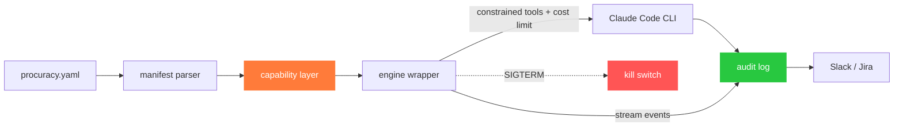

<div align="center">


<br/>

[](https://github.com/procuracy/procuracy/actions/workflows/ci.yml)
[](go.mod)
[](LICENSE)
[](#whats-working)
[](CONTRIBUTING.md)

9 CLI commands · 5 ready-to-fork templates · Jira + Slack built in · Apache 2.0

</div>

---

**For engineering teams deploying AI agents in production.** One manifest per agent. Scoped tools. Hash-chained audit log. Jira approval flow. Slack notifications. Kill switch. No SaaS, no phone-home.

> Solo dev running claude on your laptop? Just use claude directly — you don't need this. procuracy is for when "I ran an agent" becomes "my team runs 5 agents across 12 repos and security is asking questions."

```yaml
# procuracy.yaml — what the agent can and cannot do
name: aria
group: bot-docs-readonly             # inherits scopes + cost limits from groups.yaml
runtime:
  engine: claude-code
notifications:
  slack_webhook: ${SLACK_WEBHOOK_URL} # team sees every start/complete/fail
```

```bash
$ procuracy run ./aria/ --jira-ticket PROJ-456
✓ completed (cost=$0.34, turns=8, duration=45s)
✓ audit: 14 entries verified
✓ posted to Slack + commented on PROJ-456
```

---

## Try it (one command, zero config)

```bash
go install github.com/procuracy/procuracy/cmd/procuracy@latest
procuracy demo
```

Generates a sample agent + audit log, walks you through validating, verifying, and corrupting a byte to see tamper detection break the chain. Takes 30 seconds. No accounts needed.

---

## Deploy your first agent (5 minutes)

```bash
# 1. Fork a template
cp -r examples/stale-pr-nudger ./agents/nudger

# 2. Edit the manifest (change org/repo, set your webhook)
vim ./agents/nudger/procuracy.yaml
export SLACK_WEBHOOK_URL="https://hooks.slack.com/services/..."

# 3. Run it
procuracy run ./agents/nudger/
```

Your team sees the results in Slack. The audit log is at `./agents/nudger/audit.jsonl`. Verify it any time with `procuracy verify`.

**Don't want to write YAML?** Run `procuracy init` — 7 questions → working manifest + prompt file.

### Pick a template

| Template | What it does |
|---|---|
| [**stale-pr-nudger**](examples/stale-pr-nudger/) | Comments on stale PRs with context summaries |
| [**docs-maintainer**](examples/docs-maintainer/) | Syncs docs with code changes, drafts update PRs |
| [**issue-triager**](examples/issue-triager/) | Labels, categorizes, asks clarifying questions |
| [**dependabot-merger**](examples/dependabot-merger/) | Auto-merges trivial dep bumps (patch/minor, CI green) |
| [**release-notes-writer**](examples/release-notes-writer/) | Drafts changelog from merged PRs |

All templates include Slack notification config. Fork, edit, run.

---

## Roll out across your org (30 minutes)

**[Full guide → docs/team-setup.md](docs/team-setup.md)**

The short version:

**1. Define policies once** with [`groups.yaml`](examples/groups.yaml):

```yaml
bot-docs-readonly:
  scopes:
    github: [read:org/*, write:org/*/docs/**, merge:none]
  cost_limit_daily_usd: 25
  notifications:
    slack_webhook: ${SLACK_WEBHOOK_URL}
```

**2. Each agent references a group** (8 lines instead of 30):

```yaml
name: aria
group: bot-docs-readonly
runtime:
  engine: claude-code
  workspace: /tmp/procuracy/aria
handlers:
  sync_docs:
    type: claude_code
    prompt: prompts/sync.md
```

**3. Approve new agents via Jira:**

```bash
procuracy request ./agents/aria/ --jira-project BOTS
# → Creates BOTS-42 with the manifest for review

# Team lead reviews in Jira → transitions to "Approved"

procuracy hire ./agents/aria/
# → Checks BOTS-42 is approved → marks agent as provisioned
```

**4. Auto-pilot with Jira:**

```bash
procuracy watch --dir ./agents/aria/ --jira-project PROJ --jira-assignee aria
# Polls every 5 min → picks up assigned tickets → runs → posts results → transitions status
```

5 agents, one `groups.yaml`, Jira approval, Slack visibility, every action audited.

---

## How it works



**procuracy wraps Claude Code (or Codex, OpenClaw, OpenCode).** It does not replace the agent runtime — it constrains what tools the agent gets, audits what it does, enforces cost limits, and kills it if needed.

### Trust model (honest about its limits)

| What | How | Strength |
|---|---|---|
| Which tools the agent has | `--allowedTools` on the CLI | Structural — can't be prompt-injected |
| What the agent does within tools | System prompt with deny rules | Instruction-based — defeatable in theory |
| Cost limits | `--max-budget-usd` | Enforced by the agent CLI |
| Audit trail | Hash-chained JSONL | Tamper-evident — one byte change breaks the chain |
| Kill switch | SIGTERM to child process | Instant |

The tool-level and audit layers are structural. The verb-level layer is weaker; the audit log catches violations after the fact.

---

## Security

1. **Scoped tools.** Agent CLI spawned with `--allowedTools` / `--disallowedTools` from the manifest. No prompt injection can add a tool.
2. **Cost cap.** `--max-budget-usd` blocks over-budget calls.
3. **Tamper-evident audit.** Hash-chained JSONL (`sha256(prev_hash || entry)`). `procuracy verify` checks the chain.
4. **Kill switch.** SIGTERM. Instant. Recorded in the audit log.
5. **No phone-home.** Everything runs on your infra.

Report vulnerabilities via [GitHub Security Advisories](https://github.com/procuracy/procuracy/security/advisories/new).

---

## Comparisons

| | Scoped tools | Audit trail | Cost controls | Jira integration | Manifest-driven | Kill switch | Open source |
|---|:-:|:-:|:-:|:-:|:-:|:-:|:-:|
| **Multica** | ✗ | ✗ | tracking only | ✗ | ✗ (DB) | poll-based | ✓ |
| **Devin** | partial | partial | partial | ✗ | ✗ | partial | ✗ |
| **Raw Claude Code** | manual | ✗ | manual | ✗ | ✗ | Ctrl+C | partial |
| **procuracy** | **✓** | **✓** | **✓** | **✓** | **✓** | **✓** | **✓** |

**Multica** is great for managing agents (board view, skills, streaming). But `--permission-mode bypassPermissions` is hardcoded, no audit trail, no scoping. **Multica is where you manage agents. procuracy is how you trust them.** They compose.

---

## What's working

9 commands, all real (not stubs):

| Command | What it does |
|---|---|
| `procuracy demo` | Zero-config trial — 30 seconds to see the trust model in action |
| `procuracy init` | Interactive scaffolding — 7 questions → valid manifest |
| `procuracy validate` | 5-stage manifest validation (schema, scopes, capability verbs) |
| `procuracy request` | Creates a Jira approval ticket with the full manifest |
| `procuracy hire` | Provisions after Jira approval |
| `procuracy run` | Runs agent with constrained tools, cost limits, audit log, Slack/Jira notifications |
| `procuracy watch` | Jira polling daemon — assigned ticket → auto-run → transition status |
| `procuracy verify` | Hash-chain integrity check on audit logs |

Plus: 5 templates, `groups.yaml` for shared policies, [team setup guide](docs/team-setup.md), [enterprise design doc](docs/enterprise-provisioning.md).

### What's next (v0.2)

- Engine wrappers for Codex, OpenClaw, OpenCode
- Enterprise: IdP/SCIM integration, three-actor approval, AWS multi-account ([design](docs/enterprise-provisioning.md))

---

## Prerequisites

- **Go 1.25+** — to install (`go install ...@latest`)
- **Claude Code CLI** — `claude` on PATH (required for `procuracy run`)
- **Anthropic API key** — `ANTHROPIC_API_KEY` env var
- **Slack incoming webhook** (optional) — for team notifications
- **Jira API token** (optional) — for `request`, `hire`, `watch`, ticket comments

---

## Contributing

We need:
- **Templates** — new agent roles (the adoption flywheel)
- **Engine wrappers** — Codex, OpenClaw, OpenCode support
- **Security review** — capability enforcement + audit chain
- **Docs** — translations, tutorials, blog posts

See [`CONTRIBUTING.md`](CONTRIBUTING.md). Templates are just `procuracy.yaml` + prompts — no Go code.

---

<div align="center">

Apache 2.0 — free for any use, including commercial. **No telemetry. No phone-home.**

**[Try it →](#try-it-one-command-zero-config)** · **[Templates](examples/)** · **[Team setup](docs/team-setup.md)** · **[Manifest spec](docs/manifest-spec.md)** · **[Contribute](CONTRIBUTING.md)**

</div>
